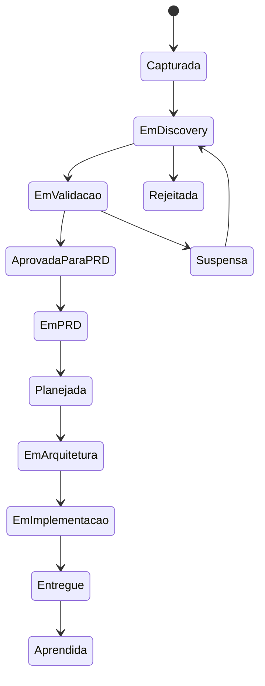

# Idea Lifecycle

## Objetivo

Definir o ciclo de vida de uma ideia dentro do Product Intelligence System.

## Estados

| Estado | Significado |
| --- | --- |
| Capturada | Ideia registrada sem análise |
| Em Discovery | Perguntas abertas estão sendo respondidas |
| Em Validação | Hipóteses críticas estão sendo testadas |
| Aprovada para PRD | Há entendimento suficiente para especificar |
| Em PRD | Documento de produto em construção |
| Planejada | MVP, roadmap e backlog inicial definidos |
| Em Arquitetura | Handoff realizado para Architecture |
| Em Implementação | Engineering executando com gates |
| Entregue | Resultado liberado e medido |
| Aprendida | Métricas e aprendizados registrados |
| Rejeitada | Ideia descartada com justificativa |
| Suspensa | Ideia válida, mas sem prioridade atual |

## Fluxo

## Regras

- Toda mudança de estado deve ter motivo.
- Ideias rejeitadas devem registrar por que não avançaram.
- Ideias suspensas devem ter condição de retomada.
- Ideias entregues devem gerar aprendizado em `memory/` ou `.ceip/memory`.

## Checklist

- [ ] Estado atual foi identificado.
- [ ] Próximo estado tem gate claro.
- [ ] Motivo de avanço, bloqueio ou rejeição foi registrado.
- [ ] Aprendizado foi capturado após entrega.

## Conclusão

Idea Lifecycle permite rastrear decisões de produto desde o primeiro sinal até aprendizado pós-release.
