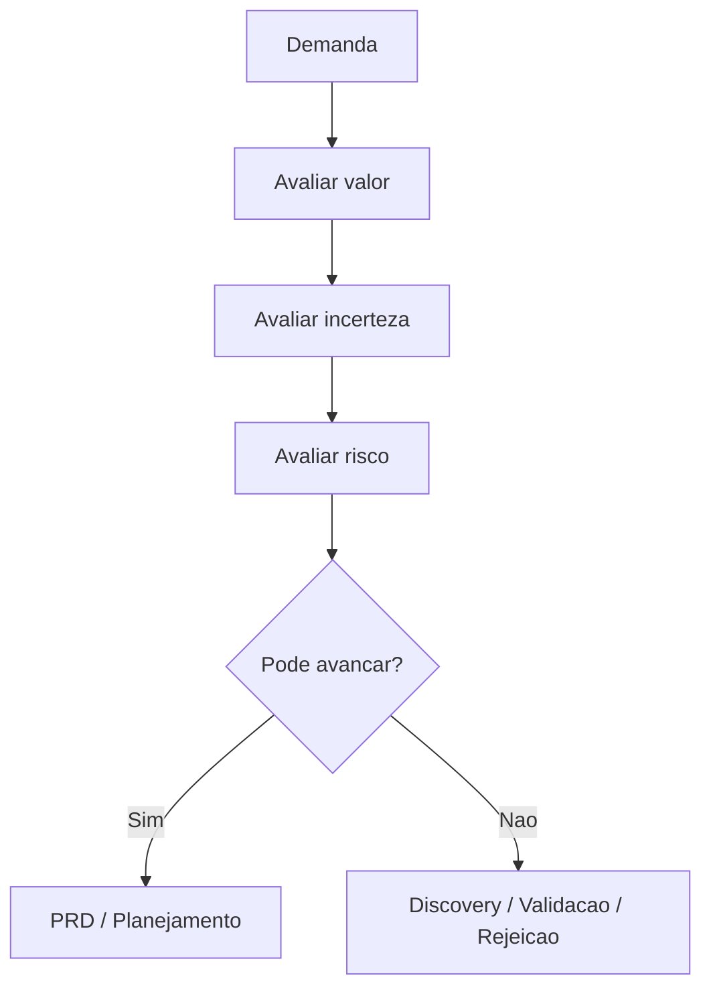

# Product Decision Framework

## Objetivo

Orientar decisões de produto antes de priorização, arquitetura ou implementação.

## Critérios de decisão

| Critério | Pergunta |
| --- | --- |
| Problema | O problema é real, frequente e relevante? |
| Usuário | O usuário afetado está claro? |
| Valor | O resultado esperado é mensurável? |
| Urgência | Existe prazo, perda ou oportunidade imediata? |
| Risco | Há impacto legal, financeiro, operacional ou reputacional? |
| Complexidade | A solução pode ser fatiada? |
| Dependência | Existe bloqueio externo? |
| Aprendizado | A iniciativa reduz incerteza importante? |

## Decisões possíveis

- Avançar para PRD.
- Retornar para discovery.
- Criar experimento de validação.
- Reduzir escopo para MVP.
- Adiar por falta de evidência.
- Rejeitar com justificativa.
- Escalar para Product Manager, Chief Engineering Officer ou aprovação humana.

## Matriz simples

| Valor | Incerteza | Decisão sugerida |
| --- | --- | --- |
| Alto | Baixa | Avançar para PRD e planejamento |
| Alto | Alta | Validar hipótese antes de arquitetura |
| Médio | Baixa | Avaliar prioridade e dependências |
| Médio | Alta | Fazer discovery adicional |
| Baixo | Qualquer | Adiar ou rejeitar |

## Fluxo

## Checklist

- [ ] Decisão tem evidência.
- [ ] Alternativas foram consideradas.
- [ ] Trade-offs foram registrados.
- [ ] Risco residual foi classificado.
- [ ] Próximo estágio foi definido.

## Conclusão

Decisão de produto deve ser explícita. O PIS não deve transformar toda ideia em backlog automaticamente.
