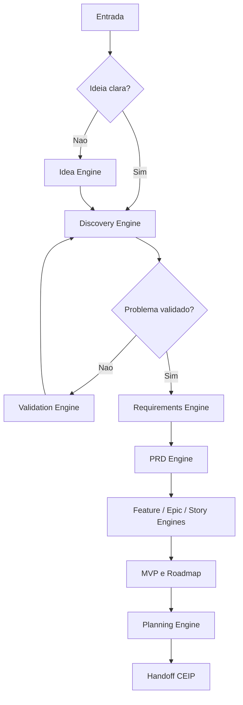

# Product Intelligence

## Objetivo

Estabelecer o funcionamento do Product Intelligence System como sistema de raciocínio e produção de artefatos de produto dentro da CEIP.

## Princípio central

Um PRD é uma saída. O PIS é o sistema que conduz perguntas, valida hipóteses, organiza mercado, negócio, requisitos, MVP, roadmap e critérios de aceite até que o produto esteja pronto para análise de negócio, gestão de produto e arquitetura.

## Escopo

O PIS cobre:

- descoberta de problema;
- clareza de público;
- contexto de negócio;
- análise de mercado e concorrência;
- requisitos;
- regras de negócio;
- PRD;
- features, epics, capabilities e stories;
- critérios de aceite;
- MVP, versões e roadmap;
- planejamento inicial.

## Fora do escopo

O PIS não:

- escolhe stack;
- desenha arquitetura técnica final;
- implementa código;
- substitui validação humana de negócio;
- inventa regra sem evidência;
- aprova risco de implementação.

## Contrato de handoff

Antes de sair do PIS, uma demanda deve entregar:

| Artefato | Obrigatório quando |
| --- | --- |
| Idea Brief | qualquer demanda nova |
| Discovery Brief | demanda com incerteza de problema, usuário ou valor |
| PRD | novo produto, módulo, API, integração ou feature relevante |
| Requirements Map | toda demanda funcional |
| Acceptance Criteria | toda feature ou story |
| MVP/Roadmap | produto, módulo ou iniciativa maior |
| Risk Notes | toda demanda de risco médio ou maior |

## Fluxo de decisão



## Qualidade mínima

- O problema deve ser escrito em linguagem de negócio.
- Requisitos devem ter origem rastreável.
- Critérios de aceite devem ser verificáveis.
- MVP deve explicar o que fica fora.
- Roadmap deve incluir dependências e riscos.
- Lacunas devem ser explícitas em vez de preenchidas por suposição.

## Exemplo rápido

Entrada:

```text
Quero criar um sistema para oficina.
```

Saída esperada:

- problema operacional das oficinas;
- personas como dono, atendente e mecânico;
- módulos como clientes, veículos, ordem de serviço, estoque, financeiro e relatórios;
- regras de negócio de status, orçamento, aprovação e entrega;
- MVP com cadastro, OS e controle básico;
- roadmap por versões;
- PRD e backlog inicial.

## Checklist

- [ ] A demanda passou por Idea ou Discovery Engine.
- [ ] Hipóteses e fatos foram separados.
- [ ] PRD ou justificativa de exceção existe.
- [ ] Requisitos têm origem.
- [ ] Features e stories estão conectadas a objetivos.
- [ ] Critérios de aceite são testáveis.
- [ ] Handoff para Business Analyst está completo.

## Conclusão

Product Intelligence é o mecanismo que impede a CEIP de transformar ideias vagas em código prematuro.
