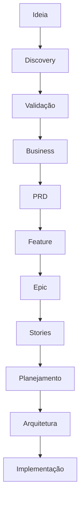

# Product Pipeline

## Objetivo

Definir o fluxo obrigatório que uma ideia percorre antes de chegar à arquitetura e à engenharia.

## Pipeline oficial

## Estágios

| Estágio | Objetivo | Saída |
| --- | --- | --- |
| Ideia | Capturar intenção inicial | Idea Brief |
| Discovery | Entender problema, usuário e contexto | Discovery Brief |
| Validação | Separar fato, hipótese e risco | Validation Notes |
| Business | Mapear regras, valor e operação | Business Context |
| PRD | Consolidar produto em documento referência | Product Requirements Document |
| Feature | Quebrar requisitos em funcionalidades | Feature Specs |
| Epic | Agrupar funcionalidades por objetivo | Epic Map |
| Stories | Escrever unidades de entrega | User Stories |
| Planejamento | Sequenciar MVP, roadmap e backlog | Plan |
| Arquitetura | Decidir solução técnica | ADR/RFC quando aplicável |
| Implementação | Executar com gates e reviews | Entrega validada |

## Gates de transição

| Transição | Gate |
| --- | --- |
| Ideia -> Discovery | problema inicial registrado |
| Discovery -> Validação | perguntas críticas respondidas ou lacunas explícitas |
| Validação -> Business | hipótese de valor e público descritos |
| Business -> PRD | regras e stakeholders mapeados |
| PRD -> Feature | escopo e fora de escopo definidos |
| Feature -> Epic | valor e dependências claros |
| Epic -> Stories | critérios de aceite e personas definidos |
| Stories -> Planejamento | stories testáveis |
| Planejamento -> Arquitetura | MVP e roadmap aprovados |
| Arquitetura -> Implementação | Policy Engine e Quality Gates aplicados |

## Regras

- Se uma transição falhar, a demanda retorna ao estágio anterior.
- Se houver urgência operacional, o Policy Engine pode permitir fluxo acelerado, mas a lacuna deve ser registrada.
- Pular Discovery exige justificativa formal.
- Pular PRD só é aceitável para mudança pequena, corretiva e bem delimitada.

## Checklist

- [ ] O estágio atual está explícito.
- [ ] A saída do estágio anterior existe.
- [ ] O gate de transição foi atendido.
- [ ] Lacunas foram registradas.
- [ ] O próximo agente recebeu contexto suficiente.

## Conclusão

Product Pipeline garante que a CEIP avance por maturidade de entendimento, não por pressa de implementação.
