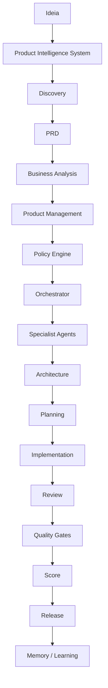

# Product Pipeline

## Objetivo

Definir o fluxo obrigatório que uma ideia percorre antes de chegar à arquitetura e à engenharia.

## Pipeline oficial

## Estágios

| Estágio | Objetivo | Saída |
| --- | --- | --- |
| Ideia | Capturar intenção inicial | Idea Brief |
| Product Intelligence System | Coordenar descoberta e especificação | Roteamento de engines |
| Discovery | Entender problema, usuário e contexto | Discovery Brief |
| PRD | Consolidar produto em documento referência | Product Requirements Document |
| Business Analysis | Mapear regras, valor e operação | Business Context |
| Product Management | Priorizar escopo, MVP e métricas | Decisão de produto |
| Policy Engine | Classificar tarefa, risco, documentos e gates | Policy decision |
| Orchestrator | Definir sequência, agentes e handoffs | Plano de orquestração |
| Specialist Agents | Analisar por domínio de impacto | Pareceres especialistas |
| Architecture | Decidir solução técnica | ADR/RFC quando aplicável |
| Planning | Sequenciar entrega incremental | Plano de execução |
| Implementation | Executar com padrões locais | Mudança implementada |
| Review | Validar qualidade técnica e documental | Parecer de revisão |
| Quality Gates | Aplicar gates obrigatórios | Decisão de gate |
| Score | Pontuar evidências e risco | Scorecard |
| Release | Liberar com controle operacional | Release validado |
| Memory / Learning | Registrar aprendizado | Memória atualizada |

## Artefatos internos do PIS

| Artefato | Objetivo | Saída |
| --- | --- | --- |
| Feature | Quebrar requisitos em funcionalidades | Feature Specs |
| Epic | Agrupar funcionalidades por objetivo | Epic Map |
| Stories | Escrever unidades de entrega | User Stories |

## Gates de transição

| Transição | Gate |
| --- | --- |
| Ideia -> Product Intelligence System | ideia registrada |
| Product Intelligence System -> Discovery | problema inicial registrado |
| Discovery -> PRD | perguntas críticas respondidas ou lacunas explícitas |
| PRD -> Business Analysis | escopo, fora de escopo e requisitos iniciais definidos |
| Business Analysis -> Product Management | regras e stakeholders mapeados |
| Product Management -> Policy Engine | MVP, prioridade e métricas definidos |
| Policy Engine -> Orchestrator | tarefa, risco, documentos e gates classificados |
| Orchestrator -> Specialist Agents | sequência e handoffs definidos |
| Specialist Agents -> Architecture | pareceres de impacto disponíveis |
| Architecture -> Planning | decisões estruturais e ADR/RFC avaliados |
| Planning -> Implementation | plano incremental e evidências definidos |
| Implementation -> Review | mudança verificável concluída |
| Review -> Quality Gates | pareceres anexados |
| Quality Gates -> Score | gates aplicados |
| Score -> Release | score mínimo e bloqueios resolvidos |
| Release -> Memory / Learning | release registrado |
| PRD -> Feature | escopo e fora de escopo definidos |
| Feature -> Epic | valor e dependências claros |
| Epic -> Stories | critérios de aceite e personas definidos |
| Stories -> Planning | stories testáveis |

## Regras

- Se uma transição falhar, a demanda retorna ao estágio anterior.
- Se houver urgência operacional, o Policy Engine pode permitir fluxo acelerado, mas a lacuna deve ser registrada.
- Pular Discovery exige justificativa formal.
- Pular PRD só é aceitável para mudança pequena, corretiva e bem delimitada.

## Checklist

- [ ] O estágio atual está explícito.
- [ ] A saída do estágio anterior existe.
- [ ] O gate de transição foi atendido.
- [ ] Lacunas foram registradas.
- [ ] O próximo agente recebeu contexto suficiente.

## Conclusão

Product Pipeline garante que a CEIP avance por maturidade de entendimento, não por pressa de implementação.
