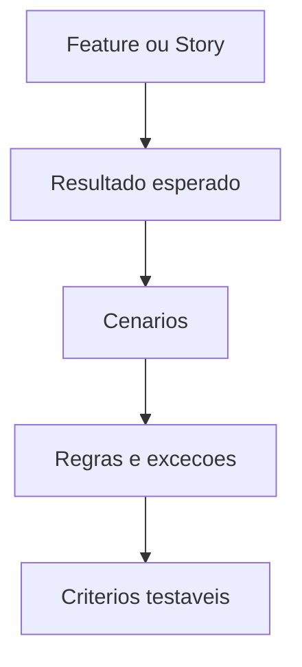

# Acceptance Criteria Engine

## Objetivo

Criar critérios de aceite claros, verificáveis e úteis para QA, Product Manager e engenharia.

## Quando usar

Use para toda feature, story, API, integração, fluxo ou regra de negócio.

## Fluxo

## Entradas

- Feature Spec.
- User Story.
- Regras de negócio.
- Requisitos.

## Processamento

1. Identificar comportamento esperado.
2. Escrever cenários positivos, negativos e exceções.
3. Validar se cada critério é testável.
4. Marcar critérios dependentes de decisão.

## Saídas

- Acceptance Criteria.
- Cenários de teste iniciais.
- Lacunas para QA ou Business Analyst.

## Exemplo

Dado cliente cadastrado e veículo vinculado, quando o atendente abrir OS, então a OS deve iniciar com status "aberta" e histórico de criação.

## Quality Gates

- Critérios são objetivos.
- Critérios cobrem exceções relevantes.
- Critérios não dependem de interpretação subjetiva.

## Integração com Policy Engine

Feature sem critérios de aceite não pode avançar para implementação.
