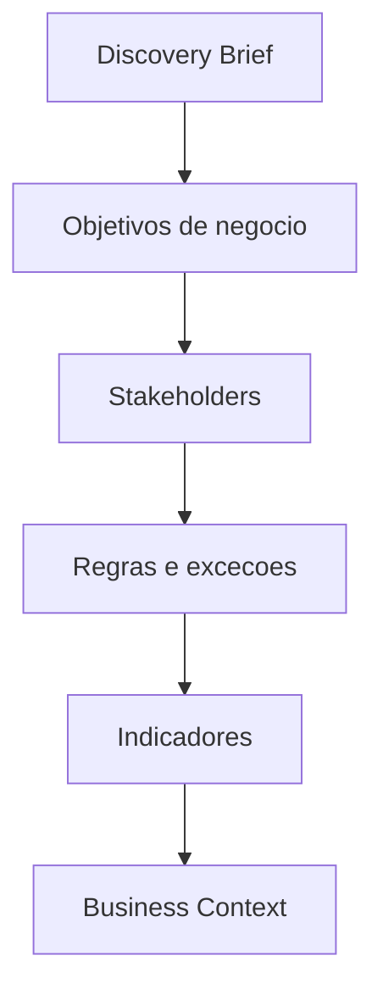

# Business Engine

## Objetivo

Converter discovery em contexto de negócio, regras, stakeholders, indicadores e restrições operacionais.

## Quando usar

Use antes de Requirements Engine em demandas com regra de negócio, operação, financeiro, contratos, vendas, atendimento ou relatórios.

## Fluxo

## Entradas

- Discovery Brief.
- Regras conhecidas.
- Stakeholders.
- Indicadores desejados.

## Processamento

1. Mapear objetivo de negócio.
2. Identificar regras, exceções e donos.
3. Definir indicadores.
4. Apontar riscos legais, financeiros ou operacionais.

## Saídas

- Business Context.
- Regras de negócio candidatas.
- Indicadores.
- Riscos e dependências.

## Exemplo

Em ordem de serviço, mapeia aprovação de orçamento, status, garantia, cobrança e entrega.

## Quality Gates

- Regras candidatas têm origem.
- Stakeholders foram identificados.
- Indicadores de sucesso foram definidos.

## Integração com Policy Engine

Mudanças financeiras, legais ou de regra crítica exigem classificação de risco e aprovação conforme `policy-engine/RISK_POLICIES.md`.
