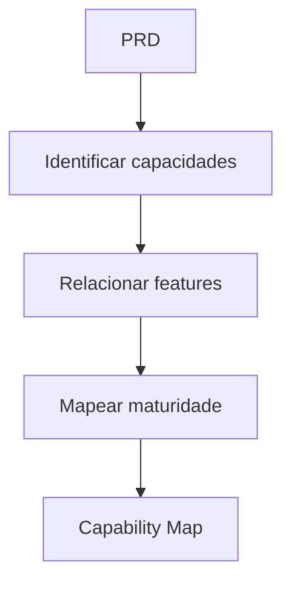

# Capability Engine

## Objetivo

Mapear capabilities de produto e negócio que a solução precisa oferecer independentemente de tela, API ou tecnologia.

## Quando usar

Use em produtos complexos, ERPs, CRMs, marketplaces, sistemas legados e plataformas com múltiplos módulos.

## Fluxo

## Entradas

- PRD.
- Business Context.
- Features.
- Domínios de negócio.

## Processamento

1. Identificar capacidades essenciais.
2. Relacionar capacidades a features e processos.
3. Mapear maturidade atual e desejada.
4. Indicar gaps.

## Saídas

- Capability Map.
- Gaps de capacidade.
- Relação capabilities -> features.

## Exemplo

Em CRM: captar lead, qualificar, negociar, fechar, acompanhar pós-venda e medir funil.

## Quality Gates

- Capabilities são independentes de stack.
- Capabilities estão vinculadas a valor.
- Gaps foram explicitados.

## Integração com Policy Engine

Capabilities críticas orientam risco, prioridade e necessidade de architecture review.
