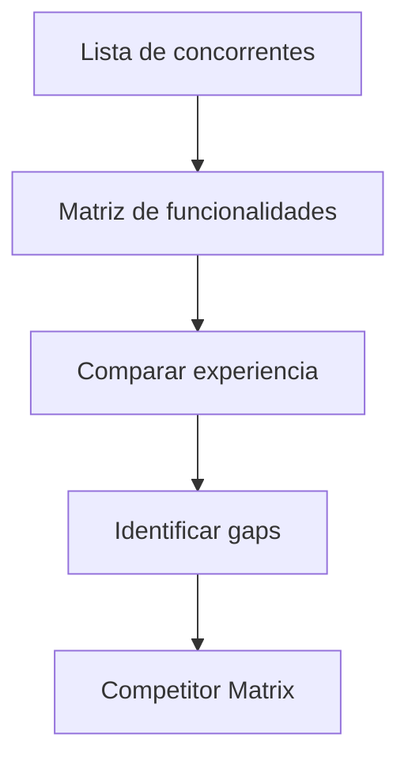

# Competitor Engine

## Objetivo

Mapear concorrentes, comparar funcionalidades, identificar diferenciais e riscos competitivos.

## Quando usar

Use quando a solução competirá com produtos existentes ou quando o cliente solicitar comparação de mercado.

## Fluxo

## Entradas

- Concorrentes conhecidos.
- Funcionalidades desejadas.
- Público-alvo.
- Evidências públicas ou fornecidas pelo cliente.

## Processamento

1. Listar concorrentes diretos e substitutos.
2. Comparar funcionalidades, preço quando conhecido, experiência e integrações.
3. Identificar gaps e diferenciais.
4. Registrar limites da análise.

## Saídas

- Competitor Matrix.
- Funcionalidades básicas de mercado.
- Diferenciais sugeridos.
- Riscos de paridade ou commoditização.

## Exemplo

Em marketplace, compara cadastro, oferta, pagamento, comissão, reputação, disputa e suporte.

## Quality Gates

- Fontes e limites da comparação estão claros.
- Diferenciais não são assumidos sem evidência.
- Funcionalidades essenciais foram separadas de diferenciais.

## Integração com Policy Engine

Claims de mercado, preço ou vantagem competitiva devem ser marcados como hipótese se não houver evidência verificável.
