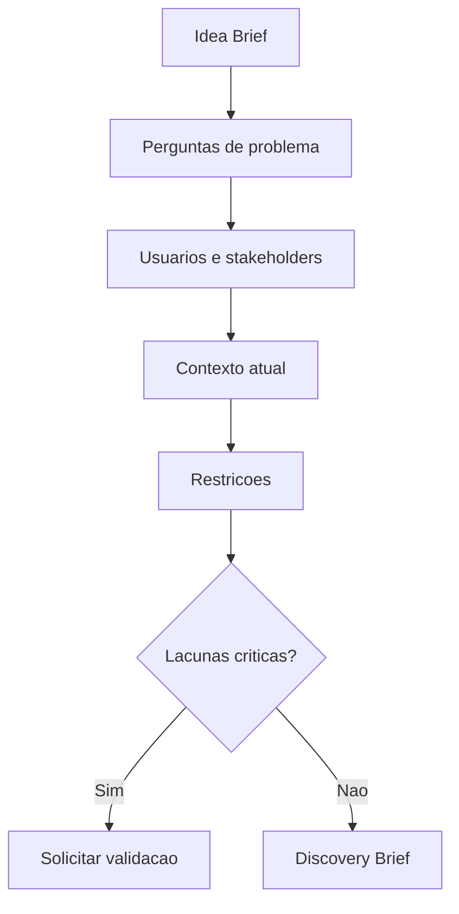

# Discovery Engine

## Objetivo

Conduzir descoberta estruturada para entender problema, usuários, contexto, restrições e hipóteses.

## Quando usar

Use antes de PRD, arquitetura ou backlog quando houver incerteza sobre problema, público, valor ou escopo.

## Fluxo

## Entradas

- Idea Brief.
- Entrevistas ou anotações.
- Contexto de operação.
- Evidências disponíveis.

## Processamento

1. Aplicar o questionário de `DISCOVERY_FRAMEWORK.md`.
2. Identificar fatos, hipóteses e dúvidas.
3. Mapear stakeholders.
4. Definir se há evidência suficiente para avançar.

## Saídas

- Discovery Brief.
- Lista de lacunas.
- Hipóteses de validação.
- Riscos iniciais.

## Exemplo

Um pedido de dashboard financeiro é convertido em perguntas sobre decisões, métricas, origem dos dados e periodicidade.

## Quality Gates

- Problema descrito sem solução embutida.
- Usuário e impacto mapeados.
- Lacunas críticas explícitas.

## Integração com Policy Engine

Se discovery for pulado ou incompleto, o Policy Engine deve registrar exceção e risco residual.
