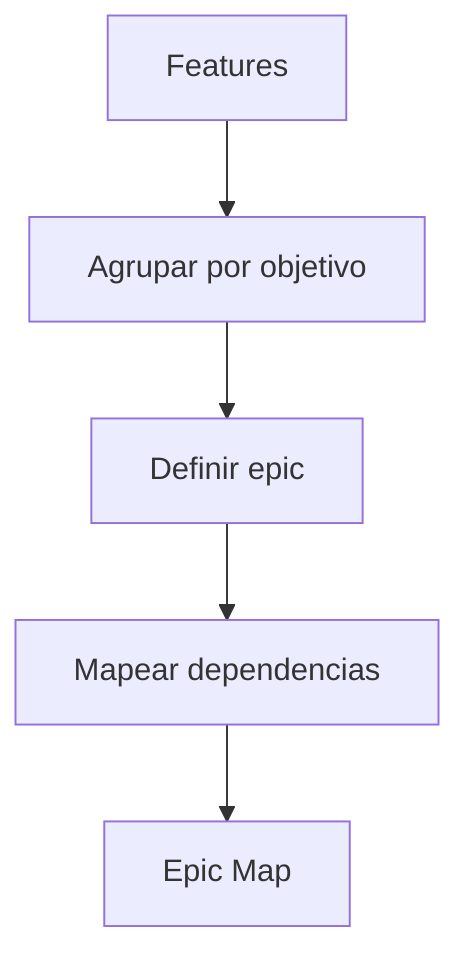

# Epic Engine

## Objetivo

Agrupar features em epics que representem objetivos maiores de produto.

## Quando usar

Use quando um conjunto de features precisa ser planejado em ondas, releases ou squads.

## Fluxo

## Entradas

- Feature Specs.
- Roadmap preliminar.
- Objetivos de negócio.

## Processamento

1. Agrupar features por resultado.
2. Definir objetivo e métrica da epic.
3. Mapear dependências.
4. Identificar releases possíveis.

## Saídas

- Epic Map.
- Features por epic.
- Métricas e dependências.

## Exemplo

Epic "Operação da Oficina" contém clientes, veículos, OS, orçamento e acompanhamento.

## Quality Gates

- Epic possui objetivo claro.
- Features pertencentes têm rastreabilidade.
- Dependências foram registradas.

## Integração com Policy Engine

Epics que alteram escopo relevante podem exigir RFC e aprovação de produto.
