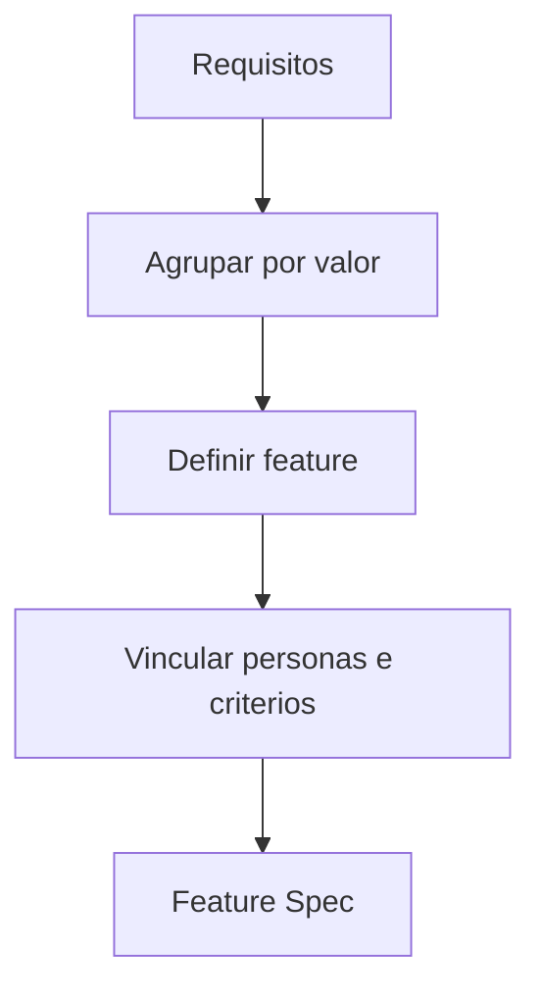

# Feature Engine

## Objetivo

Transformar requisitos em funcionalidades coerentes, com valor, escopo e critérios claros.

## Quando usar

Use depois do PRD ou Requirements Map para preparar backlog de produto.

## Fluxo

## Entradas

- PRD.
- Requirements Map.
- Personas.
- Critérios de sucesso.

## Processamento

1. Agrupar requisitos por objetivo.
2. Nomear feature pelo resultado esperado.
3. Definir escopo, fora de escopo, dependências e riscos.
4. Vincular critérios de aceite.

## Saídas

- Feature Specs.
- Relação feature -> requisitos.
- Dependências e riscos.

## Exemplo

"Gestão de Ordem de Serviço" agrupa abertura, aprovação, execução, finalização e histórico.

## Quality Gates

- Feature tem objetivo e usuário.
- Feature deriva de requisitos.
- Feature tem critérios de aceite.

## Integração com Policy Engine

Feature de risco médio ou alto exige roteamento para Business Analyst, Product Manager, QA e Architecture quando houver impacto técnico.
