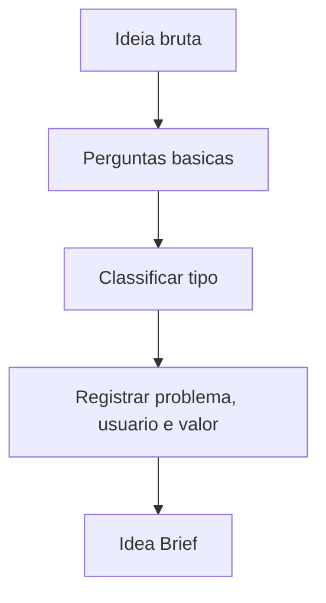

# Idea Engine

## Objetivo

Capturar uma ideia inicial e transformá-la em Idea Brief rastreável.

## Quando usar

Use quando a entrada for vaga, como "quero um sistema", "preciso de um módulo" ou "vamos automatizar esse processo".

## Fluxo

## Entradas

- Frase inicial.
- Autor da ideia.
- Contexto conhecido.
- Urgência percebida.

## Processamento

1. Registrar a ideia sem julgamento.
2. Perguntar problema, usuário, valor, restrições e prazo.
3. Separar solução sugerida de problema real.
4. Classificar se segue para Discovery Engine.

## Saídas

- Idea Brief.
- Perguntas pendentes.
- Hipóteses iniciais.
- Recomendação de próximo engine.

## Exemplo

"Quero criar um sistema para oficina" vira brief com problema operacional, usuários prováveis, resultado esperado e lacunas para discovery.

## Quality Gates

- Problema inicial registrado.
- Usuário ou stakeholder provável identificado.
- Nenhum requisito inventado.

## Integração com Policy Engine

O Policy Engine classifica se a ideia é novo produto, nova funcionalidade, módulo, API, integração ou melhoria e define documentos obrigatórios.
