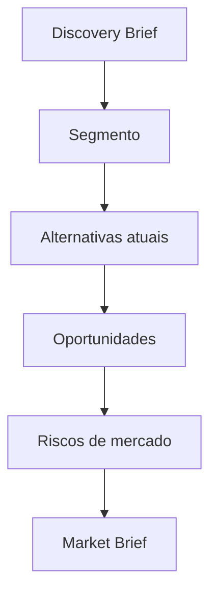

# Market Engine

## Objetivo

Analisar mercado, oportunidades, riscos e posicionamento antes de consolidar PRD ou roadmap.

## Quando usar

Use em novos produtos, SaaS, marketplace, CRM, ERP comercializável ou qualquer iniciativa com concorrência relevante.

## Fluxo

## Entradas

- Público-alvo.
- Segmento.
- Concorrentes conhecidos.
- Diferenciais pretendidos.

## Processamento

1. Mapear segmento e padrões esperados.
2. Identificar alternativas e substitutos.
3. Avaliar oportunidades e riscos.
4. Sugerir posicionamento inicial.

## Saídas

- Market Brief.
- Oportunidades.
- Riscos de posicionamento.
- Inputs para PRD e roadmap.

## Exemplo

Para um SaaS de gestão de contratos, identifica concorrentes, funcionalidades básicas e oportunidades em automação de vencimentos.

## Quality Gates

- Mercado ou segmento descrito.
- Concorrentes ou substitutos listados quando conhecidos.
- Lacunas de pesquisa explícitas.

## Integração com Policy Engine

Iniciativas de alto investimento ou alto risco comercial exigem aprovação de produto antes de arquitetura.
