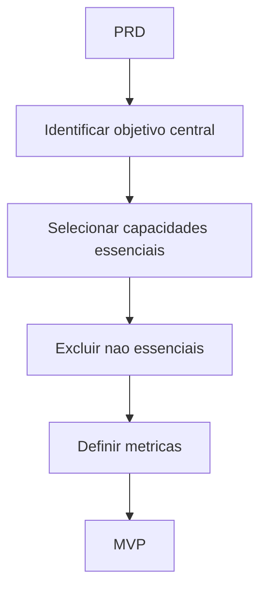

# MVP Engine

## Objetivo

Definir o menor recorte útil, validável e sustentável de produto.

## Quando usar

Use em todo novo produto, módulo, SaaS, ERP, CRM, marketplace ou feature grande.

## Fluxo

## Entradas

- PRD.
- Requirements Map.
- Features.
- Riscos.
- Métricas de sucesso.

## Processamento

1. Definir objetivo central.
2. Separar essencial, importante e futuro.
3. Declarar fora de escopo.
4. Definir métrica de validação.

## Saídas

- MVP Definition.
- Fora de escopo.
- Métricas.
- Riscos e premissas.

## Exemplo

Para oficina, MVP pode ser cliente, veículo e OS básica, deixando estoque avançado, fiscal e BI para versões futuras.

## Quality Gates

- MVP entrega valor real.
- Fora de escopo está explícito.
- Métrica de validação foi definida.

## Integração com Policy Engine

Nenhum roadmap deve avançar sem MVP definido ou exceção justificada.
