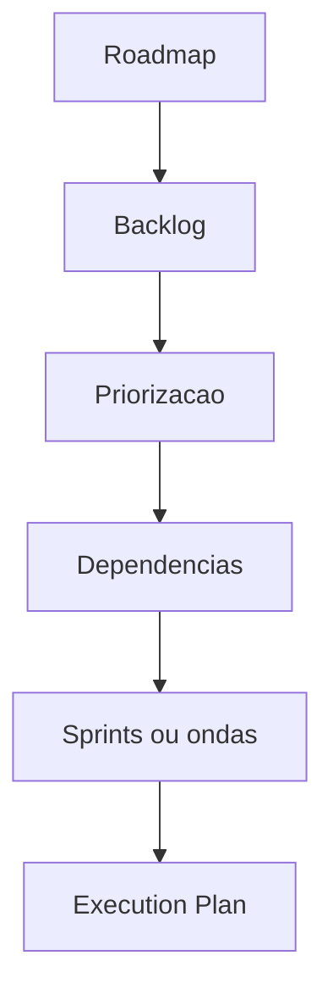

# Product Planning Engine

## Objetivo

Transformar PRD, MVP, roadmap, epics e stories em backlog inicial, priorização, sprints e dependências.

## Quando usar

Use antes de Architecture e Engineering para preparar execução rastreável.

## Fluxo

## Entradas

- PRD.
- MVP.
- Roadmap.
- Epics.
- Stories.
- Critérios de aceite.

## Processamento

1. Criar backlog inicial.
2. Priorizar por valor, risco, dependência e aprendizado.
3. Separar sprints ou ondas.
4. Definir handoff para Architecture e Orchestrator.

## Saídas

- Product Backlog.
- Sprint/Wave Plan.
- Dependências.
- Handoff de arquitetura.

## Exemplo

Sprint 1: base de clientes e veículos; Sprint 2: OS; Sprint 3: orçamento e aprovação; Sprint 4: relatórios iniciais.

## Quality Gates

- Backlog deriva de PRD e MVP.
- Stories têm critérios de aceite.
- Dependências foram registradas.

## Integração com Policy Engine

O Policy Engine decide se o plano exige RFC, ADR inicial, approval humano ou gates adicionais.
