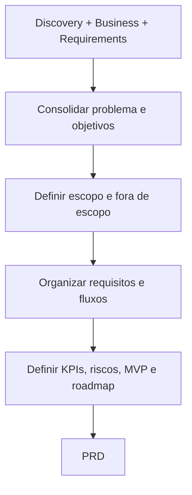

# PRD Engine

## Objetivo

Gerar um Product Requirements Document corporativo, completo e rastreável.

## Quando usar

Use para novo produto, módulo, API, integração, feature relevante, modernização de sistema ou mudança de escopo médio/alto.

## Fluxo

## Entradas

- Idea Brief.
- Discovery Brief.
- Market/Competitor Brief quando aplicável.
- Business Context.
- Requirements Map.

## Processamento

1. Consolidar resumo executivo.
2. Descrever problema, objetivos, público, personas e stakeholders.
3. Definir escopo e fora de escopo.
4. Listar requisitos funcionais, não funcionais e regras.
5. Registrar fluxos, casos de uso, integrações, segurança, performance e UX.
6. Definir critérios de aceite, KPIs, métricas, dependências, premissas, restrições, riscos, MVP, roadmap e versões futuras.

## Saídas

- PRD completo.
- Lacunas de produto.
- Handoff para Feature, MVP, Roadmap e Architecture.

## Exemplo

O PRD de oficina consolida clientes, veículos, OS, orçamento, aprovação, estoque, financeiro, relatórios, permissões e métricas de operação.

## Quality Gates

- Escopo e fora de escopo definidos.
- Requisitos rastreáveis.
- Critérios de aceite presentes.
- MVP e riscos descritos.

## Integração com Policy Engine

O Policy Engine valida se o PRD é obrigatório, se precisa RFC, quais gates se aplicam e se há aprovação humana.
