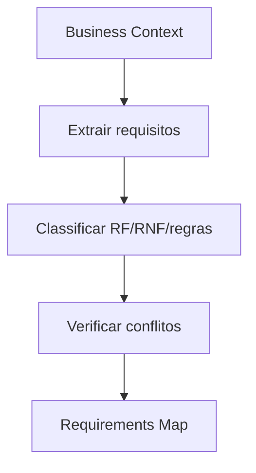

# Requirements Engine

## Objetivo

Gerar requisitos funcionais, não funcionais, regras de negócio, regras legais e regras técnicas de forma rastreável.

## Quando usar

Use depois de Discovery e Business Engine, antes de PRD, features e stories.

## Fluxo

## Entradas

- Discovery Brief.
- Business Context.
- Restrições.
- Regras e personas.

## Processamento

1. Identificar requisitos candidatos.
2. Classificar RF, RNF, regra de negócio, regra legal ou regra técnica.
3. Atribuir origem.
4. Detectar ambiguidade e conflito.

## Saídas

- Requirements Map.
- RF e RNF numerados.
- Regras de negócio.
- Lacunas e conflitos.

## Exemplo

RF001: cadastrar cliente. RNF001: resposta de busca deve ser aceitável para uso operacional. RN001: OS só pode ser finalizada após aprovação.

## Quality Gates

- Todo requisito possui origem.
- Requisitos ambíguos estão bloqueados.
- RNF tem critério mensurável ou lacuna explícita.

## Integração com Policy Engine

Requisitos de segurança, dados, performance, financeiro ou autenticação disparam policies específicas.
