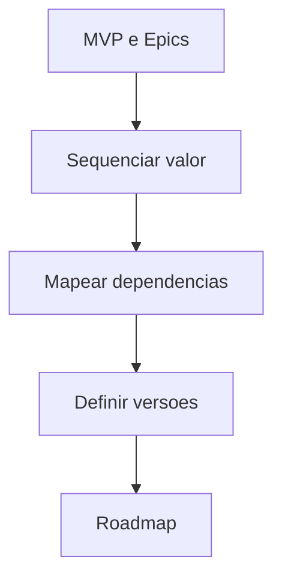

# Roadmap Engine

## Objetivo

Organizar MVP, versões futuras, dependências e prioridades em um roadmap incremental.

## Quando usar

Use após PRD, MVP Engine e Feature/Epic Engines.

## Fluxo

## Entradas

- PRD.
- MVP.
- Epics.
- Dependências.
- Riscos e restrições.

## Processamento

1. Definir releases ou versões.
2. Priorizar por valor, risco, dependência e aprendizado.
3. Separar MVP, V1, V2 e V3.
4. Registrar premissas e riscos.

## Saídas

- Roadmap.
- Versões futuras.
- Dependências e marcos.
- Itens adiados.

## Exemplo

Oficina: MVP com cadastro e OS; V1 com financeiro; V2 com estoque; V3 com BI e automações.

## Quality Gates

- Roadmap deriva do PRD.
- MVP está explícito.
- Dependências foram mapeadas.

## Integração com Policy Engine

Roadmaps com impacto estratégico exigem aprovação de Product Manager e registro de premissas.
