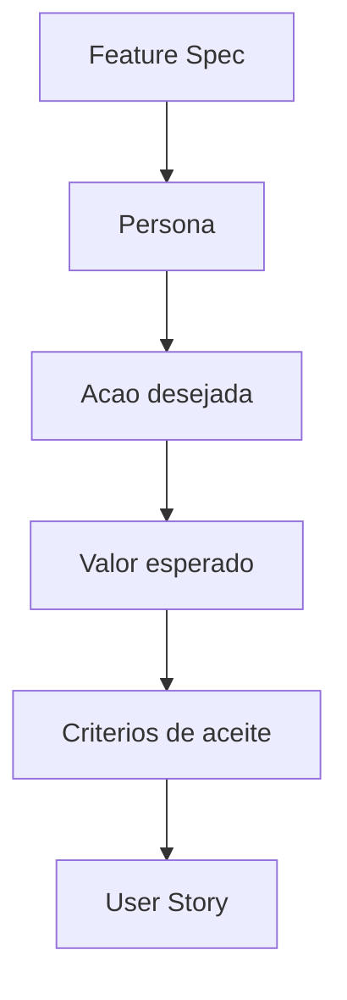

# User Story Engine

## Objetivo

Gerar histórias de usuário completas, rastreáveis e testáveis.

## Quando usar

Use depois de Feature Engine e Acceptance Criteria Engine para preparar backlog executável.

## Fluxo

## Entradas

- Feature Spec.
- Persona.
- Requisitos.
- Critérios de aceite.

## Processamento

1. Escrever história no formato "Como / Quero / Para".
2. Vincular requisito de origem.
3. Anexar critérios de aceite.
4. Registrar dependências e fora de escopo.

## Saídas

- User Stories.
- Mapa story -> feature -> requisito.
- Lacunas para QA.

## Exemplo

Como gerente da oficina, quero cadastrar cliente e veículo para abrir uma ordem de serviço com histórico rastreável.

## Quality Gates

- Story tem persona, ação e valor.
- Story pertence a uma feature.
- Story tem critérios de aceite.

## Integração com Policy Engine

Stories sem feature ou sem critério de aceite são bloqueadas antes de engineering.
