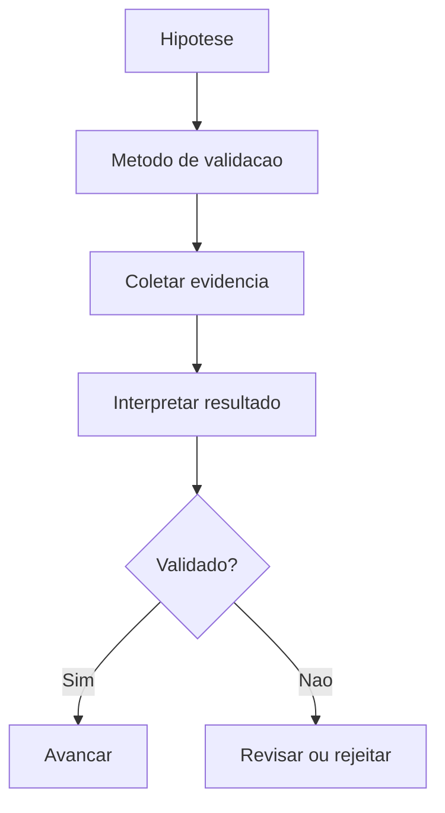

# Product Validation Engine

## Objetivo

Validar hipóteses de produto antes de investimento maior em arquitetura, design ou implementação.

## Quando usar

Use quando problema, valor, mercado, diferencial, viabilidade ou aceitação ainda forem incertos.

## Fluxo

## Entradas

- Hipóteses.
- Discovery Brief.
- Métricas esperadas.
- Critérios de decisão.

## Processamento

1. Escrever hipótese testável.
2. Definir método de validação.
3. Registrar evidências.
4. Decidir avançar, revisar, suspender ou rejeitar.

## Saídas

- Validation Notes.
- Evidências.
- Decisão.
- Aprendizados.

## Exemplo

Antes de automatizar mensagens da oficina, validar se clientes querem receber status automático e se isso reduz ligações.

## Quality Gates

- Hipótese é testável.
- Evidência foi registrada.
- Decisão segue critério pré-definido.

## Integração com Policy Engine

Hipóteses não validadas devem permanecer marcadas como risco até que a evidência exista.
