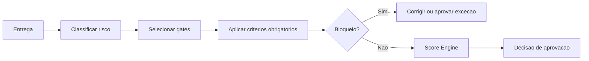

# Quality Gates

## Objetivo

Definir os gates obrigatórios que uma entrega deve atravessar antes de ser considerada pronta.

## Contexto

Quality gates funcionam como controle final de governança. Eles conectam constituição, reviews, checklists, scorecards e evidências.

## Diretrizes

- Gate falhado exige correção, mitigação ou aceite formal de risco.
- Gate não substitui julgamento técnico.
- Hotfix pode ter gate reduzido, mas exige follow-up.
- Quality Governor deve validar gates em entregas relevantes.

## Gates oficiais

| Gate | Arquivo |
| --- | --- |
| Negócio | `business-gate.md` |
| Arquitetura | `architecture-gate.md` |
| Backend | `backend-gate.md` |
| Frontend | `frontend-gate.md` |
| Banco de dados | `database-gate.md` |
| Segurança | `security-gate.md` |
| Performance | `performance-gate.md` |
| QA | `qa-gate.md` |
| Documentação | `documentation-gate.md` |
| Release | `release-gate.md` |
| Agentes de IA | `ai-agent-gate.md` |

## Aliases de compatibilidade

Os arquivos `01-architecture-gate.md` a `06-review-gate.md` preservam a sequência histórica do framework. Eles não criam gates concorrentes. Quando houver dúvida, o arquivo nomeado é a referência principal.

| Alias | Referência principal |
| --- | --- |
| `01-architecture-gate.md` | `architecture-gate.md` |
| `02-security-gate.md` | `security-gate.md` |
| `03-performance-gate.md` | `performance-gate.md` |
| `04-testing-gate.md` | `qa-gate.md` |
| `05-documentation-gate.md` | `documentation-gate.md` |
| `06-review-gate.md` | `review/README.md`, `review/specialist-review-process.md` e `engines/quality-engine.md` |

## Fluxo

## Exemplos

- Uma mudança visual simples pode passar por gates reduzidos, mas ainda precisa de review e documentação quando alterar comportamento.
- Uma migração de dados passa por todos os gates.

## Checklist

- [ ] Todos os gates aplicáveis foram avaliados.
- [ ] Bloqueios foram tratados.
- [ ] Riscos aceitos têm justificativa.
- [ ] Scorecard foi preenchido quando necessário.
- [ ] Score mínimo por risco foi aplicado.

## Conclusão

Quality gates impedem que uma entrega avance apenas porque "funcionou" localmente.
