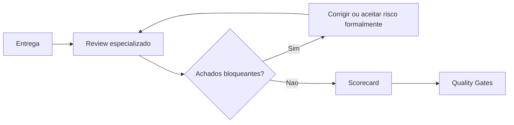

# Review Engine

## Objetivo

Padronizar revisões especializadas antes de considerar uma entrega pronta.

## Contexto

Checklists validam presença de critérios. O Review Engine define como especialistas devem avaliar risco, evidência, bloqueios e recomendações por área.

## Diretrizes

- Revisão deve ser baseada em evidência.
- Achados devem ter severidade, impacto e recomendação.
- Bloqueios devem apontar lei, gate, checklist ou risco concreto.
- Review não deve virar preferência estética.
- Para revisão da plataforma, usar `specialist-review-process.md` e rodadas `round-01` a `round-08`.
- Para revisão de entrega, usar os arquivos por disciplina e quality gates aplicáveis.

## Fluxo

## Exemplos

- Uma migração de banco passa por `database-review.md`.
- Uma feature com dados sensíveis passa por `security-review.md`.
- Uma tela crítica passa por `frontend-review.md` e `qa-review.md`.
- Uma auditoria da CEIP passa por arquitetura, documentação, negócio, QA, code review, segurança, performance e governança final.

## Relatórios de auditoria geral

- `audit-inventory.md`
- `conceptual-consistency-report.md`
- `operational-flow-report.md`
- `stack-agnostic-audit.md`
- `agents-audit.md`
- `brains-audit.md`
- `engines-audit.md`
- `product-intelligence-audit.md`
- `policy-engine-audit.md`
- `orchestrator-audit.md`
- `core-workspace-audit.md`
- `installer-audit.md`
- `templates-checklists-playbooks-audit.md`
- `security-privacy-audit.md`
- `navigation-audit.md`
- `final-audit-report.md`
- `release-candidate-report.md`
- `technical-debt-method.md`

## Checklist

- [ ] Review correto foi escolhido.
- [ ] Entradas estão completas.
- [ ] Achados têm severidade.
- [ ] Bloqueios têm justificativa.
- [ ] Saída foi registrada.
- [ ] Rodada especializada correta foi usada quando a revisão era da CEIP.

## Conclusão

O Review Engine transforma revisão em processo técnico auditável.
