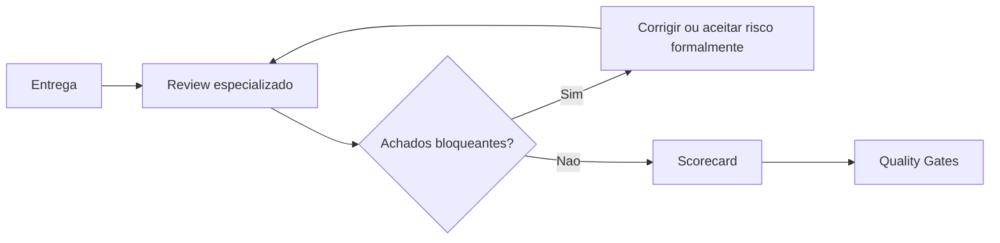

# Review Engine

## Objetivo

Padronizar revisões especializadas antes de considerar uma entrega pronta.

## Contexto

Checklists validam presença de critérios. O Review Engine define como especialistas devem avaliar risco, evidência, bloqueios e recomendações por área.

## Diretrizes

- Revisão deve ser baseada em evidência.
- Achados devem ter severidade, impacto e recomendação.
- Bloqueios devem apontar lei, gate, checklist ou risco concreto.
- Review não deve virar preferência estética.

## Fluxo

## Exemplos

- Uma migração de banco passa por `database-review.md`.
- Uma feature com dados sensíveis passa por `security-review.md`.
- Uma tela crítica passa por `frontend-review.md` e `qa-review.md`.

## Checklist

- [ ] Review correto foi escolhido.
- [ ] Entradas estão completas.
- [ ] Achados têm severidade.
- [ ] Bloqueios têm justificativa.
- [ ] Saída foi registrada.

## Conclusão

O Review Engine transforma revisão em processo técnico auditável.
