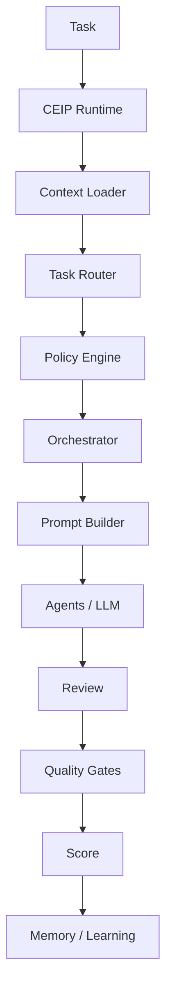

# Release Candidate Report RC-1

## Resumo Executivo

A auditoria executiva RC-1 avaliou a CEIP como se fosse adotada por uma empresa global de software. O principal bloqueio encontrado era a ausência de uma camada dinâmica capaz de transformar documentos em execução operacional para IAs e pessoas.

O bloqueio foi corrigido com a criação do CEIP Runtime, Context Loader, Task Router, Prompt Builder, Prompt Runtime, Decision Runtime, Runtime API, policies de runtime, Workspace runtime, validação runtime e comandos CLI operacionais.

Decisão do Board: **APROVADA**.

## Problemas Encontrados

| Severidade | Problema | Impacto |
| --- | --- | --- |
| Crítica | CEIP era forte como método, mas ainda estática | IAs precisavam descobrir fluxo manualmente |
| Crítica | Não havia Context Loader formal | Risco de prompts com contexto insuficiente ou excessivo |
| Crítica | Não havia Prompt Builder operacional | Prompts fixos não refletiam tarefa, risco e Workspace |
| Alta | `ceip doctor` não validava Runtime | Workspaces podiam passar sem execução dinâmica |
| Alta | CLI não oferecia comandos operacionais além de init/doctor/version | DX/AIX dependia de leitura manual |
| Média | Roadmap ainda refletia histórico, não maturidade RC | Navegação estratégica ficava confusa |
| Média | Falta de pontos de extensão para domains, capabilities, profiles e plugins | Escala futura ficaria concentrada no Core |

## Problemas Corrigidos

- Criado `runtime/`.
- Criado `runtime/execution-pipeline.md`.
- Criado `runtime/task-router.md`.
- Criado `runtime/context-loader.md`.
- Criado `runtime/prompt-builder.md`.
- Criado `runtime/decision-runtime.md`.
- Criado `runtime/prompt-runtime.md`.
- Criado `runtime/runtime-api.md`.
- Criado `policy-engine/RUNTIME_POLICIES.md`.
- Installer passou a criar `.ceip/runtime/`.
- `project.json` passou a declarar Runtime, Context Loader e Prompt Builder.
- `ceip doctor` passou a validar Runtime.
- CLI passou a suportar `analyze`, `plan`, `architect`, `review`, `release` e `learn`.
- Criados pontos de extensão: `domains/`, `capabilities/`, `profiles/` e `plugins/`.
- Atualizados `README.md`, `INDEX.md`, `ROADMAP.md`, `AGENTS.md`, `CODEX.md`, `CONSTITUTION.md`, `POLICY_ENGINE.md` e `ORCHESTRATOR.md`.
- Criada `validation/runtime-validation.md`.

## Problemas Pendentes

- `ceip upgrade` ainda precisa migrar Workspaces antigos.
- Domain Packs ainda não possuem conteúdo por domínio.
- Capability Packs ainda não possuem templates por capacidade.
- Profiles ainda não são selecionáveis no Installer.
- Runtime Packs ainda não possuem orçamento de contexto por tokens.
- Auditoria automática ampla ainda não virou `ceip audit`.

Nenhum item pendente bloqueia produção inicial, desde que a adoção comece com projetos novos ou Workspaces migrados manualmente.

## Riscos

| Risco | Nível | Mitigação |
| --- | --- | --- |
| Uso em Workspace antigo sem Runtime | Médio | `ceip doctor` acusa ausência de Runtime |
| Excesso de contexto enviado à IA | Médio | Context Loader define contexto suficiente e regras de segurança |
| Bypass de governança por executor humano | Médio | Constitution, Runtime Policies, AGENTS e CODEX atualizados |
| Adoção enterprise sem upgrade command | Médio | Dívida registrada para v1.5 |
| Packs futuros aumentarem complexidade | Baixo | Profiles, domains e capabilities foram definidos como extensões opcionais |

## Arquitetura

A arquitetura final aprovada é:

## Governança

Governança está aprovada porque Runtime não substitui Constituição, Policy Engine ou Orchestrator. Ele os torna executáveis.

## Qualidade

Quality Gates, Score System, Validation Suite e Review Process permanecem coerentes. A nova validação de Runtime fecha a lacuna de execução dinâmica.

## Experiência

Developer Experience melhora com comandos CLI que geram Runtime Packs. AI Experience melhora porque prompts passam a ser montados por tarefa, contexto, policies, agentes e gates.

## Score Executivo

| Área | Nota |
| --- | ---: |
| Arquitetura | 96 |
| Governança | 96 |
| Product Intelligence | 95 |
| Product Experience | 95 |
| CloudSix Design Language | 95 |
| Policy Engine | 96 |
| Orchestrator | 95 |
| Brains | 92 |
| Engines | 93 |
| Installer | 94 |
| Workspace | 95 |
| Runtime | 94 |
| Developer Experience | 93 |
| AI Experience | 95 |
| Segurança | 94 |
| Performance | 90 |
| Escalabilidade | 94 |
| Documentação | 97 |
| Conhecimento | 92 |
| Memory | 91 |
| Patterns | 90 |
| Recipes | 89 |
| Templates | 92 |
| Validation | 94 |
| Review Process | 94 |

Score Geral: **94/100**.

## Class World Review

### Pontos em que a CEIP já se destaca

- Integração explícita entre método, workspace, runtime, policies, agentes e gates.
- Separação Core + Workspace clara.
- Agnosticismo tecnológico preservado.
- Product Intelligence antes de engenharia.
- Product Experience e CDL antes de frontend.
- Runtime que prepara prompts sem chamar LLM automaticamente.

### Pontos para evoluir

- Upgrade automatizado.
- Audit command.
- Profiles aplicados no Installer.
- Domain Packs e Capability Packs reais.
- Marketplace instalável.
- CEIP Evolution para transformar aprendizados em policies, patterns e templates.

## Recomendações

- Iniciar piloto com GSA Oficina ou projeto equivalente.
- Rodar `ceip init`, `ceip doctor`, `ceip analyze`, `ceip plan`, `ceip architect`, `ceip review` e `ceip release` no piloto.
- Medir tempo de onboarding, retrabalho, achados de review e clareza de prompts.
- Criar `ceip upgrade` antes de migrar muitos projetos existentes.

## Próximos Passos

1. Publicar RC-1.
2. Executar piloto real.
3. Registrar achados em `review/`.
4. Priorizar `ceip upgrade` e `ceip audit`.
5. Criar Domain Pack de Oficina/ERP como primeiro pack real.

## Conclusão

A CEIP está pronta para produção inicial controlada. A plataforma saiu de documentação avançada para plataforma operacional de engenharia assistida por IA.

## Decisão Final

APROVADA
