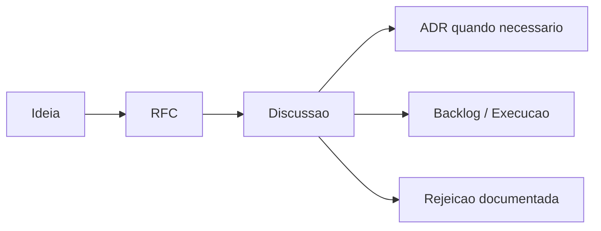

# RFC Repository

## Objetivo

Organizar propostas técnicas e de produto antes de virarem decisões, projetos ou implementações.

## Contexto

Toda mudança grande deve nascer como proposta discutível. O repositório de RFCs cria um espaço para análise antes de compromisso arquitetural ou operacional.

## Diretrizes

- Use uma pasta numerada para cada RFC.
- Inclua problema, contexto, proposta, alternativas, riscos e decisão esperada.
- Relacione ADRs quando a RFC gerar decisão arquitetural.
- Não use RFC para mudanças triviais.

## Fluxo

## Exemplos

- Nova plataforma de integração.
- Modernização de legado.
- Introdução de automação com IA.

## Checklist

- [ ] Problema foi descrito.
- [ ] Proposta é avaliável.
- [ ] Alternativas existem.
- [ ] Riscos foram listados.
- [ ] Critério de decisão foi definido.

## Conclusão

RFCs melhoram a qualidade da discussão antes que a implementação crie custo de mudança.
