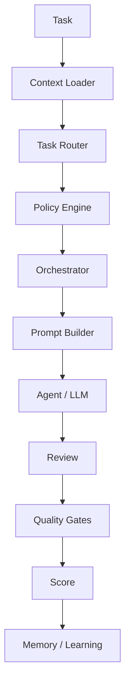

# CEIP Runtime

## Objetivo

Transformar a CEIP de um conjunto estático de documentos em uma plataforma operacional capaz de decidir fluxo, carregar contexto, montar prompts, acionar agentes e registrar evidências de execução.

## Contexto

Sem Runtime, uma IA precisa descobrir manualmente quais documentos ler, quais policies aplicar, quais agentes chamar e quais gates validar. O CEIP Runtime remove essa ambiguidade ao definir uma sequência única para qualquer tarefa relevante.

## Componentes

| Documento | Função |
| --- | --- |
| `runtime.md` | Contrato executivo do Runtime |
| `execution-pipeline.md` | Pipeline obrigatório de execução |
| `task-router.md` | Classificação e roteamento de tarefas |
| `context-loader.md` | Regras para montar contexto suficiente |
| `prompt-builder.md` | Montagem de prompts por tarefa, contexto e policies |
| `decision-runtime.md` | Decisões, exceções, ADR/RFC e critérios |
| `prompt-runtime.md` | Execução segura de prompts por IAs |
| `runtime-api.md` | Contrato operacional para CLI e futuras automações |

## Fluxo



## Regras

- Runtime não substitui Constitution, Policy Engine ou Orchestrator.
- Runtime sempre consulta o Workspace `.ceip/` quando existir.
- Runtime nunca deve carregar segredos, tokens, chaves ou dados sensíveis desnecessários.
- Prompt Builder deve montar contexto suficiente, não contexto máximo.
- Toda decisão de alto risco deve passar por Policy Engine, ADR/RFC ou aprovação formal.
- Toda saída relevante deve registrar evidência no Workspace.

## Comandos Relacionados

```bash
ceip analyze
ceip plan
ceip architect
ceip review
ceip release
ceip learn
```

Esses comandos geram Runtime Packs e prompts em `.ceip/output/generated-prompts/` quando o projeto possui Workspace.

## Checklist

- [ ] Contexto mínimo foi carregado.
- [ ] Tarefa foi classificada.
- [ ] Policies foram aplicadas.
- [ ] Orchestrator definiu agentes e sequência.
- [ ] Prompt Builder gerou instrução clara.
- [ ] Gates e score foram considerados.
- [ ] Aprendizado foi registrado quando aplicável.

## Conclusão

O CEIP Runtime é a camada que torna a CEIP operacional para pessoas, CLI e agentes de IA.
