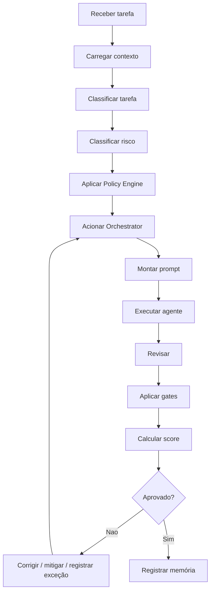

# Execution Pipeline

## Objetivo

Definir a sequência oficial de execução do CEIP Runtime.

## Pipeline

## Critérios De Entrada

- Objetivo da tarefa conhecido.
- Projeto identificado.
- Workspace consultável ou exceção registrada.
- Stack e restrições verificadas quando aplicável.

## Critérios De Saída

- Plano ou entrega com evidência.
- Gates aplicáveis avaliados.
- Riscos e exceções registrados.
- Aprendizados classificados.

## Bloqueios

- Contexto insuficiente para decisão.
- Risco alto sem policy aplicável.
- Interface relevante sem Product Experience e CDL.
- Produto ou feature sem Product Intelligence quando obrigatório.
- Mudança arquitetural sem ADR quando necessário.

## Conclusão

O pipeline impede que a IA salte diretamente de tarefa para implementação.
