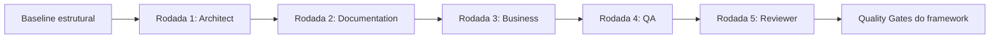

# Processo de Revisão por Especialistas

## Objetivo

Definir rodadas de revisão focadas para amadurecer o framework sem pedir a uma IA para "melhorar tudo" de uma vez.

## Contexto

Revisões amplas tendem a gerar mudanças genéricas e inconsistentes. Rodadas por especialista preservam foco, reduzem conflito e permitem melhorias mais profundas.

## Diretrizes

- Cada rodada deve ter escopo fechado.
- O especialista não deve alterar áreas fora do objetivo da rodada.
- Achados devem ser classificados como bloqueante, alto, médio ou baixo.
- Melhorias devem citar documentos afetados.
- Mudanças devem atualizar `INDEX.md`, `ROADMAP.md` ou `ORCHESTRATOR.md` quando necessário.

## Rodadas oficiais

| Rodada | Especialista | Objetivo |
| --- | --- | --- |
| 1 | Chief Architect | Revisar arquitetura da documentação |
| 2 | Documentation Engineer | Padronizar linguagem, títulos, índice e referências |
| 3 | Business Analyst | Validar aplicabilidade a projetos reais |
| 4 | QA Engineer | Encontrar inconsistências e lacunas verificáveis |
| 5 | Code Reviewer Tech Lead | Avaliar qualidade geral da documentação |

## Fluxo

## Exemplos

- Se o Chief Architect encontrar sobreposição entre `docs/adr` e `adr`, ele deve propor fronteira clara.
- Se o Documentation Engineer encontrar títulos inconsistentes, deve padronizar nomenclatura sem mudar decisões técnicas.

## Checklist

- [ ] Rodada tem escopo definido.
- [ ] Especialista correto foi acionado.
- [ ] Achados foram priorizados.
- [ ] Mudanças fora do escopo foram evitadas.
- [ ] Resultado foi registrado.

## Conclusão

Revisão por especialistas transforma maturidade documental em processo controlado.
