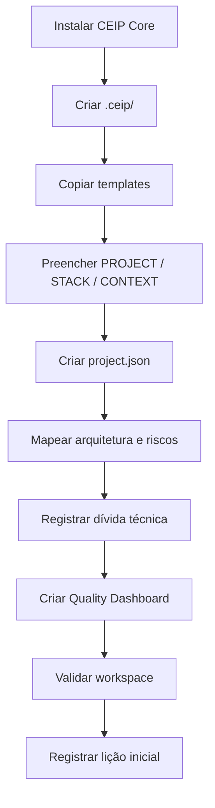

# Fluxo de Inicialização do Workspace

## Objetivo

Definir o processo recomendado para inicializar `.ceip/` em um projeto consumidor.

## Processo

Com CEIP Installer:

```bash
ceip init
```

ou:

```bash
node bin/ceip.js init
```

Fluxo lógico executado pelo wizard:

```text
1. Adicionar CEIP Core ao projeto.
2. Criar pasta .ceip/.
3. Criar arquivos principais do workspace.
4. Preencher PROJECT.md.
5. Preencher STACK.md.
6. Preencher CONTEXT.md.
7. Criar project.json.
8. Mapear arquitetura inicial.
9. Registrar riscos conhecidos.
10. Registrar dívida técnica inicial.
11. Criar primeiro Quality Dashboard.
12. Rodar validação inicial.
13. Registrar primeira lição aprendida.
```

## Fluxo Mermaid



## Critérios de conclusão

- `.ceip/PROJECT.md` existe.
- `.ceip/STACK.md` existe.
- `.ceip/CONTEXT.md` existe.
- `.ceip/project.json` existe.
- `.ceip/ARCHITECTURE_MAP.md` existe.
- `.ceip/QUALITY_DASHBOARD.md` existe.
- `AGENTS.md` do projeto orienta leitura de Core + Workspace.

## Checklist

- [ ] Core foi instalado ou referenciado.
- [ ] Workspace foi criado.
- [ ] Arquivos principais foram preenchidos.
- [ ] Riscos e dívida técnica foram registrados.
- [ ] Validação inicial foi executada.

## Conclusão

Inicialização bem feita dá contexto suficiente para agentes de IA e humanos trabalharem sem suposições.
