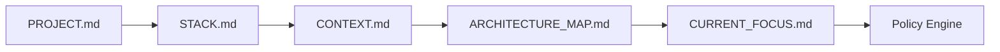

# Guia de Contexto do Projeto

## Objetivo

Orientar como registrar contexto local em `.ceip/` para que agentes de IA e pessoas entendam o projeto antes de propor mudanças.

## Arquivos principais

| Arquivo | Conteúdo |
| --- | --- |
| `PROJECT.md` | Nome, objetivo, domínio, status, responsáveis e escopo |
| `STACK.md` | Linguagens, frameworks, bancos, infraestrutura, testes e observabilidade identificados |
| `CONTEXT.md` | Contexto geral, restrições, histórico e pontos de atenção |
| `CURRENT_FOCUS.md` | Prioridade atual do projeto |
| `KNOWN_ISSUES.md` | Problemas conhecidos |
| `TECHNICAL_DEBT.md` | Dívida técnica |
| `ARCHITECTURE_MAP.md` | Mapa arquitetural local |
| `QUALITY_DASHBOARD.md` | Estado de qualidade e métricas |

## Regras

- Diferencie fato, inferência e hipótese.
- Não registre segredo.
- Não invente regra de negócio.
- Atualize o contexto quando uma decisão mudar o entendimento do projeto.
- Use linguagem objetiva e verificável.

## Fluxo de consulta

## Checklist

- [ ] Objetivo do projeto está claro.
- [ ] Stack foi observada, não assumida.
- [ ] Restrições estão documentadas.
- [ ] Problemas conhecidos estão listados.
- [ ] Arquitetura local foi mapeada.

## Conclusão

Contexto local reduz suposições e torna o uso da CEIP mais preciso.
