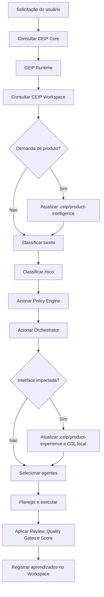

# CEIP Workspace

## Objetivo

Definir como projetos consumidores devem manter contexto local usando uma pasta `.ceip/`, sem misturar conhecimento específico de cliente com o CEIP Core.

## Contexto

O repositório `method-ceip` é o CEIP Core: a fonte oficial de Constituição, Policy Engine, Orchestrator, Brains, Engines, agentes, padrões, playbooks, templates, validações e governança global.

Cada projeto que usa o método deve manter seu próprio CEIP Workspace em `.ceip/`. Esse workspace guarda estado local: contexto, stack, Runtime local, Product Intelligence local, Product Experience local, CloudSix Design Language local, memória, ADRs, RFCs, tarefas, reviews, métricas, artefatos, logs e configurações do projeto.

## Princípio central

```text
CEIP Core = método global reutilizável
CEIP Workspace = contexto local do projeto
```

Nunca copie o CEIP Core inteiro para `.ceip/`. O workspace deve conter somente informações específicas do projeto consumidor.

## Documentos

| Documento | Uso |
| --- | --- |
| `WORKSPACE_ARCHITECTURE.md` | Arquitetura Core + Workspace |
| `CEIP_CORE_VS_WORKSPACE.md` | Diferenças entre Core e Workspace |
| `INSTALLATION_GUIDE.md` | Instalação por submodule ou referência externa |
| `INITIALIZATION_FLOW.md` | Passo a passo para criar `.ceip/` |
| `WORKSPACE_STRUCTURE.md` | Estrutura recomendada do workspace |
| `PROJECT_CONTEXT_GUIDE.md` | Como registrar contexto do projeto |
| `MEMORY_GUIDE.md` | Como registrar memória local |
| `ADR_RFC_GUIDE.md` | Como registrar decisões e propostas |
| `TASK_MANAGEMENT_GUIDE.md` | Como organizar tarefas |
| `ARTIFACTS_GUIDE.md` | Como armazenar artefatos |
| `METRICS_GUIDE.md` | Como registrar métricas |
| `REVIEWS_GUIDE.md` | Como registrar reviews |
| `SECURITY_AND_PRIVACY.md` | O que pode ou não ser armazenado |
| `UPDATE_GUIDE.md` | Como atualizar Core e Workspace |
| `VALIDATION_GUIDE.md` | Como validar integração |

## Fluxo obrigatório



## Checklist

- [ ] O projeto tem CEIP Core acessível em `.cloudsix/method` ou referência externa.
- [ ] O projeto tem workspace local em `.ceip/`.
- [ ] O workspace não duplica o CEIP Core.
- [ ] Demandas relevantes passam por `.ceip/runtime/`.
- [ ] Demandas de produto registram artefatos em `.ceip/product-intelligence/`.
- [ ] Demandas com interface registram artefatos em `.ceip/product-experience/`, incluindo CDL local e conformidade CDL.
- [ ] O `AGENTS.md` do projeto aponta para Core + Workspace.
- [ ] Aprendizados específicos do projeto ficam em `.ceip/`.
- [ ] Melhorias globais retornam para o repositório `method-ceip`.

## Conclusão

O CEIP Workspace transforma a CEIP em um sistema operacional de engenharia por projeto, mantendo o Core limpo, reutilizável e versionado.
