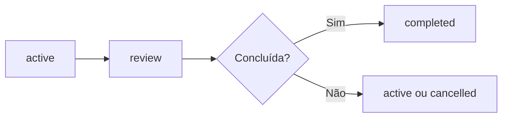

# Guia de Gestão de Tarefas no Workspace

## Objetivo

Definir como registrar tarefas locais em `.ceip/tasks/`.

## Estrutura

```text
.ceip/tasks/
  README.md
  active/
  completed/
  cancelled/
```

## Quando criar tarefa

- Feature relevante.
- Correção com risco.
- Refatoração planejada.
- Auditoria.
- Investigação técnica.
- Ação resultante de review, gate ou incidente.

## Conteúdo mínimo

- Objetivo.
- Contexto.
- Tipo de tarefa.
- Risco.
- Agentes envolvidos.
- Gates aplicáveis.
- Critérios de conclusão.
- Evidências.

## Fluxo



## Checklist

- [ ] A tarefa tem objetivo claro.
- [ ] Risco foi classificado.
- [ ] Agentes e gates foram definidos.
- [ ] Evidências foram registradas.
- [ ] Status está atualizado.

## Conclusão

Tarefas no Workspace tornam o trabalho auditável e rastreável por projeto.
