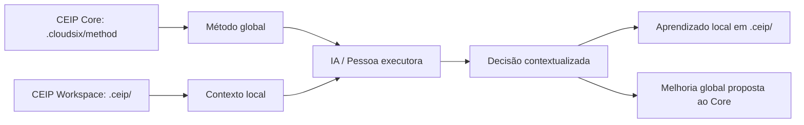

# Arquitetura CEIP Core + Workspace

## Objetivo

Definir a arquitetura de separação entre o CEIP Core e o CEIP Workspace.

## Contexto

Sem separação entre método global e contexto local, projetos tendem a misturar padrões corporativos com informações específicas de cliente. Isso dificulta atualização do método, aumenta risco de vazamento de informação e reduz reutilização.

## Componentes

### CEIP Core

O Core é o repositório oficial `method-cloudsix`. Ele contém:

- Constituição.
- Policy Engine.
- Orchestrator.
- Brains e Engines.
- Agentes.
- Quality Gates e Score Engine.
- Standards, playbooks, templates e recipes.
- Validation Suite.
- Governança global.

### CEIP Workspace

O Workspace é a pasta `.ceip/` dentro de cada projeto consumidor. Ele contém:

- Contexto do projeto.
- Stack identificada.
- Memória local.
- ADRs e RFCs do projeto.
- Tarefas, reviews e métricas.
- Artefatos e relatórios.
- Logs e configurações locais.

## Relação

## Regras

- O Core governa como trabalhar.
- O Workspace informa o contexto do projeto.
- O Workspace nunca substitui o Core.
- O Core nunca deve armazenar dados sensíveis de clientes.
- O projeto consumidor deve versionar somente o que for seguro em `.ceip/`.
- Itens temporários e sensíveis devem ser ignorados por `.gitignore`.

## Exemplos

- Uma nova regra de arquitetura aplicável a todos os projetos deve ir para o Core.
- Uma decisão de arquitetura específica do GSA Oficina deve ir para `.ceip/adr/`.
- Uma lição recorrente aprendida em vários projetos pode nascer em `.ceip/memory/` e virar proposta de melhoria para o Core.

## Checklist

- [ ] A informação é global? Então pertence ao Core.
- [ ] A informação é específica do projeto? Então pertence ao Workspace.
- [ ] A informação contém segredo? Então não deve ser versionada.
- [ ] A informação pode virar padrão reutilizável? Então deve ser proposta ao Core.

## Conclusão

Core + Workspace torna a CEIP escalável: um núcleo comum e um estado local por projeto.
