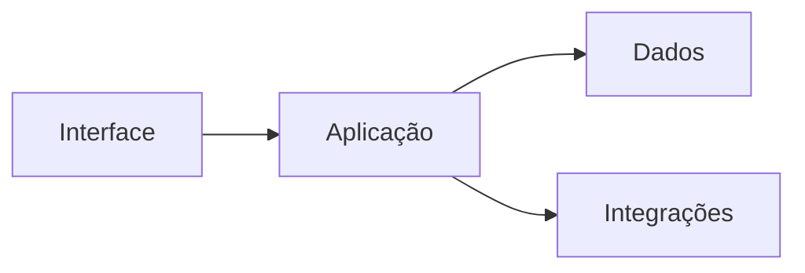

# Mapa de Arquitetura

## Objetivo

Mapear arquitetura local do projeto.

## Visão geral

Descreva módulos, camadas, serviços, integrações e dados principais.

## Diagrama

## Módulos

| Módulo | Responsabilidade | Dependências | Risco |
| --- | --- | --- | --- |
|  |  |  |  |

## Fluxos críticos

- 

## Checklist

- [ ] Módulos foram identificados.
- [ ] Dependências foram registradas.
- [ ] Fluxos críticos foram mapeados.
- [ ] Decisões relevantes têm ADR.

## Conclusão

Mapa arquitetural orienta impacto antes de mudança.
